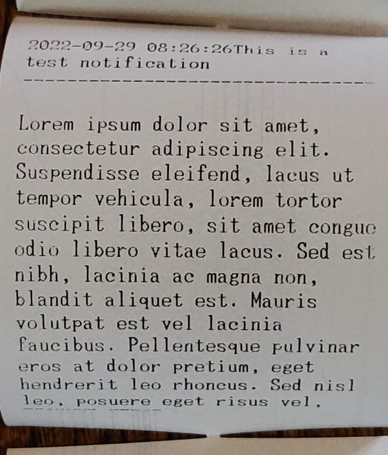
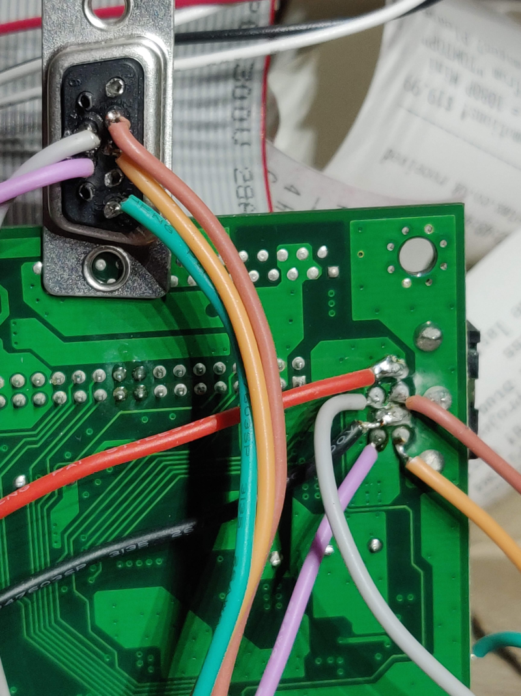
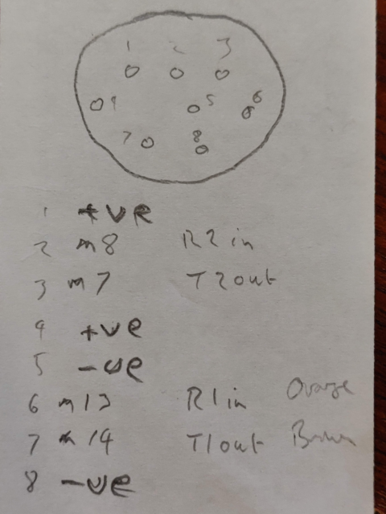
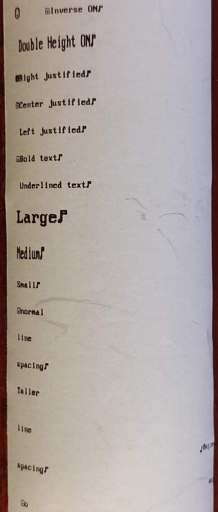

# FTP-629-Printer
Thermal till roll printer demo program

Demonstration using ESP32 to drive RS232 signals via adapter to controller board for Fujitsu FTP-629 

Uses arduino library https://github.com/gdsports/ESC_POS_Printer/blob/master/ESC_POS_Printer.cpp

Repurposed to drive second serial port on ESP32 microcontroller, USB port used for usual status info etc.

[Hardware manual](./documents/ftp-629mcl054_353_354.pdf)

[Protocol Manual](./documents/ftp-62gdsl001.pdf)

[Python library](https://github.com/python-escpos/python-escpos)

## Notification printing example programme

[Notification Printer](./NotificationPrinter/notifications.py)

### Sample output

### Board connections

Hardwired to 9 way serial socket for connection to PC

##### Layout

|a|b|
|-|-|
|1|5|
|2|6|
|3|7|
|4|8|

#### Wires

|Pin#|Colour|
|----|------|
|1|red|
|2|brown|
|3|black|
|4|orange|
|5|red|
|6|grey|
|7|black|
|8|mauve|

#### 9 way D socket connections

|Pin#|Wire|
|----|----|
|1|n/c|
|2|brown|
|3|orange|
|4|n/c|
|5|green|
|6|n/c|
|7|grey|
|8|mauve|
|9|n/c|

#### Min DIN Connections

| No.| Name|Func|
|----|-----|----|
|  1 | +ve | 24V |
|  2 | CTS | In  |
|  3 | RTS | Out |
|  4 | +ve | 24V |
|  5 | -ve | gnd |
|  6 | RxD | In  |
|  7 | TxD | Out |
|  8 | -ve | gnd |

### DIP Switches

|  Switch|  Default| Purpose  |
|--------|---------|----------|
|    1   |   On    | Baudrate |
|    2   |   On    | Baudrate |
|    3   |   On    | Baudrate |
|    4   |   On    | Baudrate |
|    5   |   Off   | Unknown  |
|    6   |   Off   | Unknown  |
|    7   |   Off   | Programming |
|    8   |   Off   | Test Mode|

### Test program

[Arduino sketch](./A_printertest)

### Initial printout

